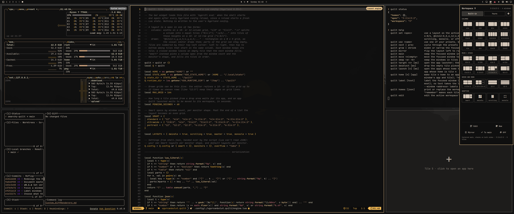
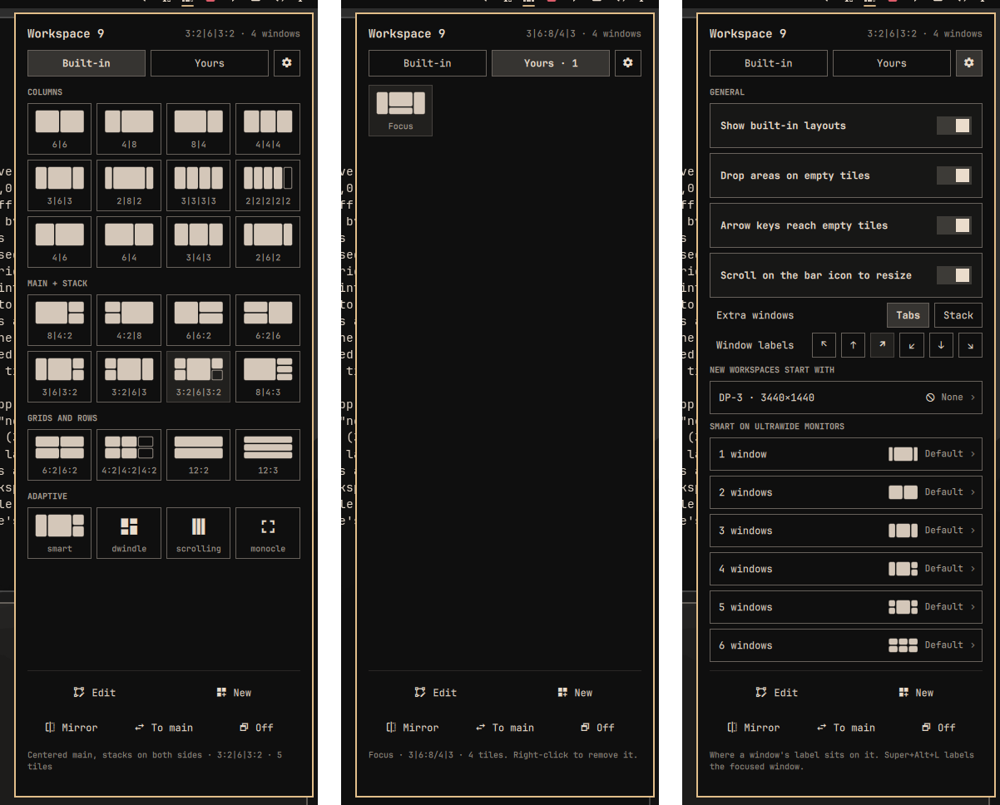
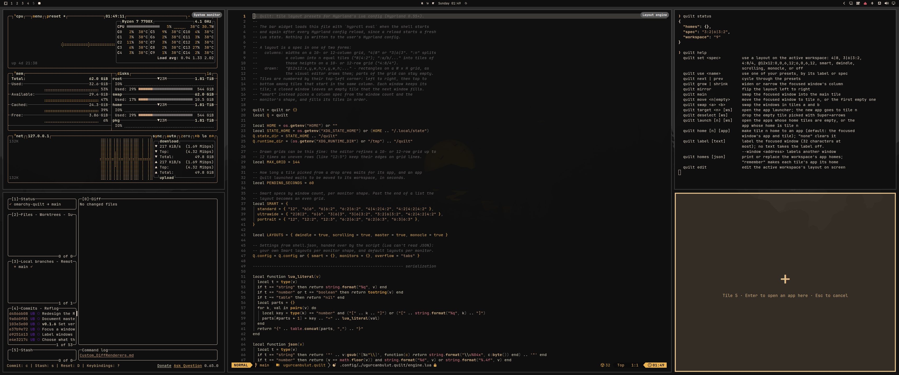
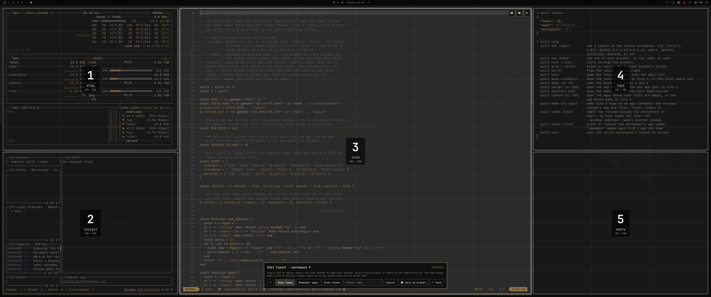
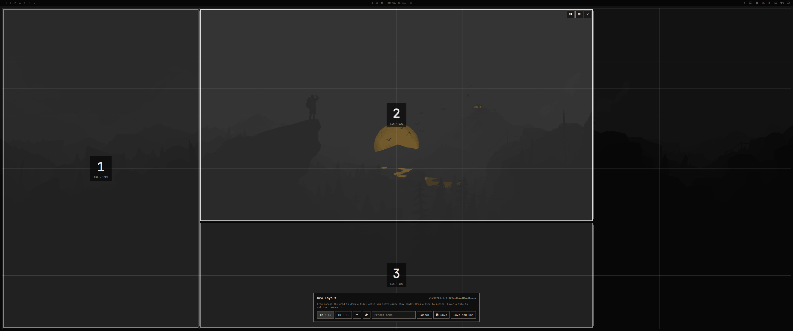

<div align="center">

# Quilt

**Tiling layouts for [Omarchy](https://omarchy.org), right from the bar.**<br>
Pick a layout, draw your own on screen, leave space empty on purpose, and save apps into their places.

[](https://github.com/ugurcanbulut/omarchy-quilt/tags)
[](LICENSE)


[Install](#install) · [Features](#features) · [Zen mode](#zen-mode) · [Keys](#keys) · [Editor](#the-editor) · [App homes](#app-homes) · [Settings](#settings) · [Command line](#command-line)



</div>

## Install

```bash
omarchy plugin add https://github.com/ugurcanbulut/omarchy-quilt.git --enable
```

The widget joins the right side of the bar. To move it:

```bash
omarchy bar move ugurcanbulut.quilt --section right --index 0
```

### Remove

```bash
omarchy plugin remove ugurcanbulut.quilt
hyprctl reload
```

The reload drops Quilt's layout engine from the running Hyprland: workspaces go back to Omarchy's layout, and Super+arrows, Super+Shift+arrows and Super+Alt+L back to Omarchy. Saved layouts stay in `~/.local/state/quilt/` and your presets on the Quilt entry in `~/.config/omarchy/shell.json`, in case you reinstall; delete them if you won't.

### Requirements

Quilt needs Omarchy 4 with Hyprland 0.55 or newer (Hyprland's Lua config), and `jq`, which a standard Omarchy install has. Nothing is written to your Hyprland config: Quilt registers its layout while Hyprland runs, and removing the plugin leaves no trace.

## Features

https://github.com/user-attachments/assets/c50ab122-fff1-4100-9abc-6da8cd3f5cba

### Layouts

A Quilt layout is a set of real regions. It can fill the monitor, use only part of it, or leave deliberate holes between tiles.

Two simple examples:

```text
3|6|3                              8|4:2

┌────────┬────────────────┬────────┐    ┌────────────────────┬──────────┐
│        │                │        │    │                    │          │
│   3    │       6        │   3    │    │         8          │    2     │
│        │                │        │    │                    ├──────────┤
│        │                │        │    │                    │    2     │
└────────┴────────────────┴────────┘    └────────────────────┴──────────┘
```

- **28 built-in layouts** in four groups: columns, main + stack, grids and rows, and adaptive ones. The popup draws each as a small picture of your current number of windows; hover one to read what it does.
- **Your own layouts.** Draw any arrangement in the [editor](#the-editor), including intentional empty space, and keep it on the popup's **Yours** tab.
- **Smart** picks the layout from the number of windows and the monitor's shape ([details](#smart)).
- **Hyprland's own layouts** (dwindle, scrolling, monocle) are one click away, and **Off** hands the workspace back to Omarchy.
- **Per workspace, remembered** across Hyprland reloads and reboots. The bar icon draws the current workspace's layout.
- **Monitor defaults:** new workspaces on a monitor can start with a layout of your choice, like Smart on an ultrawide.

<p align="center"></p>

### Zen mode

Custom layouts do **not** have to fill the monitor. Cells with no tile stay genuinely empty.

```text
┌───────────────────────────────────────────────────────────────┐
│                                                               │
│             ┌───────────────────────────────┐                 │
│             │                               │                 │
│             │                               │                 │
│             │          YOUR WINDOW          │                 │
│             │                               │                 │
│             │                               │                 │
│             └───────────────────────────────┘                 │
│                                                               │
└───────────────────────────────────────────────────────────────┘
        unused space                         unused space
```

A useful ultrawide setup is what I call **Zen mode**: one normal-sized working region in the middle of a very wide display, with the rest left alone.

No fake spacer windows. No application-specific rules. The space around the window simply is not part of the layout.

<p align="center"></p>

The editor can make this directly. Draw only the region you want, leave the rest of the grid blank, and save it like any other preset. The same idea works for asymmetric layouts and deliberate gaps between windows.

### Windows

Closing a window does not make the layout collapse around it:

```text
BEFORE                              AFTER CLOSING THE MIDDLE WINDOW

┌──────────┬──────────────┬──────────┐    ┌──────────┬──────────────┬──────────┐
│ Obsidian │   Chromium   │ Terminal │    │ Obsidian │      +       │ Terminal │
└──────────┴──────────────┴──────────┘    └──────────┴──────────────┴──────────┘
```

- **Windows keep their tiles.** Close one and its tile stays empty instead of the others shifting around; the next window you open fills it.
- **Main first.** Windows fill the biggest tile first, so a single window in `3|6|3` sits in the middle.
- **Extra windows become tabs.** With more windows than tiles, the extras join the last tile as tabs (Hyprland's window groups) and move back out as soon as there's room, oldest first. A group you make yourself with <kbd>Super</kbd> <kbd>G</kbd> keeps its tile while you switch tabs.
- **Drop areas.** Empty tiles show an outline with a **+**. Click one to open the app launcher, and the app you pick opens in that tile.
- **Swap with the keyboard or mouse.** <kbd>Super</kbd> <kbd>Shift</kbd> + arrows trades the focused window with the one in the next tile, or moves it into that tile if it's empty. <kbd>Super</kbd> + drag drops a window onto another tile.
- **Live control.** Scroll on the bar icon to widen or narrow the focused window's column; right-click it for the next layout. In the popup, **Mirror** flips the layout and **To main** swaps the focused window into the biggest tile.

### Keyboard

- **Arrow keys reach empty tiles.** On a grid layout, <kbd>Super</kbd> + arrows move tile to tile, empty ones included. An empty tile you stop on lights up and takes the keyboard: <kbd>Enter</kbd> opens the app launcher for it, <kbd>Esc</kbd> goes back to your window, and any app you open meanwhile lands there. The window you left shows an inactive border until you move on.



### Apps in their place

- **App homes.** A layout can remember which app goes in which tile, so your browser always opens in the middle and terminals on the right.
- **One-click launch.** A preset with homes opens the apps that aren't there yet, each straight into its tile. See [App homes](#app-homes).

### Window labels

- <kbd>Super</kbd> <kbd>Alt</kbd> <kbd>L</kbd> puts a label of up to 32 characters on the focused window, in the corner or edge you choose in the settings.
- A label takes the window's border colour, and the active border colour while the window has focus.
- Labels work on any workspace and layout, follow their window, stay out of the way of clicks, and last as long as the window. An empty label takes it off.

## Keys

| Keys | What they do |
|---|---|
| <kbd>Super</kbd> + <kbd>←</kbd> <kbd>→</kbd> <kbd>↑</kbd> <kbd>↓</kbd> | Move between tiles, empty ones included |
| <kbd>Super</kbd> <kbd>Shift</kbd> + <kbd>←</kbd> <kbd>→</kbd> <kbd>↑</kbd> <kbd>↓</kbd> | Trade places with the next tile's window, or move into an empty tile |
| <kbd>Enter</kbd> · <kbd>Esc</kbd> on a picked tile | Open the app launcher for it · back to your window |
| <kbd>Super</kbd> <kbd>Alt</kbd> <kbd>L</kbd> | Label the focused window |
| <kbd>Super</kbd> + drag | Drop a window onto another tile |

Quilt takes Super+arrows and Super+Shift+arrows over only while they're Omarchy's own, and hands them back when you turn **Arrow keys reach empty tiles** off; Super+Alt+L only while it's free. Bindings of your own are left alone.

In the popup, the arrow keys and <kbd>Enter</kbd> pick a layout, and these act right away:

| Key | Action | | Key | Action |
|---|---|---|---|---|
| <kbd>E</kbd> | Edit the current layout | | <kbd>M</kbd> | Mirror |
| <kbd>N</kbd> | Draw a new layout | | <kbd>S</kbd> | Focused window to the main tile |
| <kbd>O</kbd> | Use the preset and open its apps | | <kbd>X</kbd> | Off |

<details>
<summary><b>More key bindings of your own</b></summary>

Quilt adds no other bindings. To add some, put lines like these in `~/.config/hypr/bindings.lua`, after checking `omarchy menu keybindings --print` for chords you already use:

```lua
local quilt = os.getenv("HOME") .. "/.config/omarchy/plugins/ugurcanbulut.quilt/quilt"
o.bind("SUPER + CTRL + ALT + RIGHT", "Next layout", quilt .. " next")
o.bind("SUPER + CTRL + ALT + LEFT", "Previous layout", quilt .. " prev")
o.bind("SUPER + CTRL + ALT + EQUAL", "Widen column", quilt .. " grow")
o.bind("SUPER + CTRL + ALT + MINUS", "Narrow column", quilt .. " shrink")
o.bind("SUPER + CTRL + ALT + RETURN", "Window to main tile", quilt .. " main")
o.bind("SUPER + CTRL + ALT + E", "Edit layout", quilt .. " edit")
o.bind("SUPER + CTRL + ALT + H", "Make this tile the app's home", quilt .. " home")
o.bind("SUPER + CTRL + ALT + 1", "Window to tile 1", quilt .. " move 1")
```

</details>

## The editor

The popup has two buttons for making layouts of your own:

- **Edit** opens the current workspace's layout on screen, over your windows. Drag the lines between tiles to resize them, hover a tile to split it or remove it, drag a tile onto another to swap their windows, and drag across empty cells to add a tile. Every change applies as you make it.
- **New** takes you to an empty workspace (99, or the next free one below it) with a blank 12 × 12 grid (or 10 × 10). Drag across the grid to draw tiles of any shape and size, and leave cells empty wherever you want a gap.

| Button | Edit | New |
|---|---|---|
| **Save as preset** / **Save** | Keeps the layout in your presets | Adds it to your presets and takes you back |
| **Done** / **Save and use** | Keeps it on this workspace only | Also puts it on the workspace you came from |
| **Cancel** or <kbd>Esc</kbd> | Puts everything back: layout, gaps, app homes, and where each window sat | Leaves without saving |

While editing, **Keep homes**, **Remember apps** and **Clear homes** choose what happens to the [app homes](#app-homes). <kbd>Ctrl</kbd> <kbd>Z</kbd> undoes the last change, and the toolbar can be dragged by its title if it covers a tile.

<table>
<tr>
<td width="50%"></td>
<td width="50%"></td>
</tr>
<tr>
<td align="center"><b>Edit</b> the layout you're on</td>
<td align="center">Draw a <b>New</b> one from scratch</td>
</tr>
</table>

Drawing a layout, naming it and using it:

https://github.com/user-attachments/assets/13edcbea-128e-4dd4-ab7d-b22f3bd1176a

## App homes

Give a tile an app and that app opens there, whatever else is on the workspace:

```text
DEV

┌──────────────┬────────────────────────┬──────────────┐
│              │                        │              │
│   Obsidian   │        Chromium        │   Terminal   │
│              │                        │              │
└──────────────┴────────────────────────┴──────────────┘

                 Open preset
                      ↓
       missing apps launch into their homes
```

- In the editor, choose **Remember apps** before **Save as preset** or **Done**: each tile keeps the app that's in it now. **Keep homes**, where the editor starts, leaves the homes as they are, following their tiles as you reshape the layout; **Clear homes** removes them.
- Or run `quilt home` on the focused window to make its tile that app's home (`quilt home 3` for tile 3; `quilt home 3 none` clears it).

A new window goes to its app's home if it's free. If something else sits there, that window steps aside to a free tile, or shares the overflow tile when none is free. Other windows fill the free tiles first and use an empty home only when nothing else is left, so the tile is still free when its app opens. Switching to a preset with homes also moves the windows already on the workspace into them. Apps are matched by their window class, which the editor shows on each tile.

### Launching

- In the popup, presets with app homes have a rocket in the corner. Click it, or press <kbd>O</kbd> on the preset, to use the preset and open each of its apps that isn't on the workspace yet, straight into its tile.
- An empty home tile's drop area opens its own app when clicked. Right-click it to pick another app from the launcher.
- `quilt launch` does the same for the current workspace, and `quilt launch 3` opens tile 3's app.

Quilt starts apps the way Omarchy's launcher does, finding each one's desktop entry by its window class, including web apps installed with Omarchy. If you switch workspaces while an app is starting, its window still arrives on the workspace it was opened for.

## Layouts on a grid

Every layout is written as column widths on a **10- or 12-column grid**, separated by `|`. The total tells Quilt which grid you mean:

| Spec | Grid | Result |
|---|---|---|
| `6\|6` | 12 | Two halves |
| `4\|8` | 12 | One third, two thirds |
| `4\|4\|4` | 12 | Three equal columns |
| `3\|6\|3` | 12 | A wide center column, great on ultrawide monitors |
| `4\|6` | 10 | 40% and 60% |
| `2\|6\|2` | 10 | 20% · 60% · 20% |

Add `:n` to split a column into `n` stacked tiles of the same height, or list the heights (adding up to 10 or 12) to make them uneven:

| Spec | Result |
|---|---|
| `8\|4:2` | A main window with two stacked on the right |
| `3\|6\|3:2` | A centered main window, two stacked on the right |
| `6:2\|6:2` | A 2 × 2 grid |
| `12:3` | Three rows, for vertical monitors |
| `4:8/4\|8` | On the left, a tall tile over a short one; a wide column on the right |

Tiles are numbered by their top-left corner: left to right, and top to bottom among tiles that start in the same column. In `6:2|6:2`, tiles 1 and 2 are the left column.

<details>
<summary><b>Drawn layouts</b></summary>

Anything that isn't columns can be drawn as rectangles on a grid: `@12x12:` followed by `x,y,width,height` for each tile, in grid cells. `@12x12:0,0,12,4;0,4,6,8;6,4,6,8` is a banner across the top with two tiles under it. Cells no tile covers stay empty, and tiles can't overlap. You rarely need to type these: the editor writes them for you.

</details>

### Smart

Smart picks the layout from the number of windows and the monitor's shape:

| Windows | Standard | Ultrawide | Vertical |
|---|---|---|---|
| 1 | `12` | `2\|8\|2` | `12` |
| 2 | `6\|6` | `6\|6` | `12:2` |
| 3 | `6\|6:2` | `3\|6\|3` | `12:3` |
| 4 | `6:2\|6:2` | `3\|6\|3:2` | `6:2\|6:2` |

Past six windows it switches to an even grid. You can set your own layouts for any window count in the [settings](#settings).

## Settings

The gear tab in the popup holds Quilt's settings:

| Setting | |
|---|---|
| **Show built-in layouts** | Off keeps only the adaptive ones on the Built-in tab |
| **Drop areas on empty tiles** | The outlined **+** areas |
| **Arrow keys reach empty tiles** | Super+arrows and Super+Shift+arrows, tile by tile |
| **Scroll on the bar icon to resize** | Widen or narrow the focused column |
| **Extra windows** | As tabs in the last tile, or stacked there |
| **Window labels** | A top or bottom corner, or the middle of either edge |
| **New workspaces start with** | A default layout for each connected monitor |
| **Smart on … monitors** | The layout Smart uses for 1 to 6 windows on monitors shaped like the one you're on |

Choosing a layout opens a picker of the same pictures as the other tabs. Everything is saved to the Quilt entry in `~/.config/omarchy/shell.json`.

<details>
<summary><b>Editing shell.json by hand</b></summary>

Layouts saved from the editor show up on the **Yours** tab and in the next/previous cycle; right-click one twice to remove it. They live in a `presets` list on the Quilt entry, where you can also add them by hand, along with the other settings:

```json
{ "id": "ugurcanbulut.quilt",
  "presets": [
    "5|7",
    { "spec": "2|8|2", "label": "Focus", "gapsOut": 40 },
    { "spec": "3|6|3", "label": "Dev", "apps": { "1": "obsidian", "2": "chromium", "3": "alacritty" } }
  ],
  "smart": { "ultrawide": ["3|6|3", "6|6", "3|6|3"] },
  "monitors": { "DP-3": "smart", "eDP-1": "Dev" } }
```

- **`presets`**: a spec string, or an object with `spec` and optional `label`, `gapsIn` and `gapsOut` (in pixels), and `apps` (tile number to window class, see [App homes](#app-homes)). `quilt use Dev` applies a preset by its label, which is handy for key bindings.
- **`smart`**: Smart's layout for 1, 2, 3, ... windows, per monitor shape: `standard`, `ultrawide` (2:1 and wider) or `portrait`. Where your list has no usable layout for a window count (it's shorter, or the entry is `null`), Smart uses its own.
- **`monitors`**: a layout for new workspaces on a monitor: a spec, `smart`, a Hyprland layout, or one of your presets by label (with its gaps and apps). Run `hyprctl monitors` for the names. A workspace keeps following its monitor's default, including when you change it, until you pick a layout or Off there yourself.
- **`builtInPresets: false`** keeps only the adaptive layouts (Smart, Dwindle, Scrolling, Monocle) on the Built-in tab.
- **`overflow: "stack"`** stacks extra windows in the last tile instead of making them tabs.
- **`navigation: false`** gives Super+arrows and Super+Shift+arrows back to Hyprland's plain focus move and swap.
- **`labelPosition`**: `top-left`, `top-center`, `top-right` (the default), `bottom-left`, `bottom-center` or `bottom-right`.

</details>

## Command line

The `quilt` script next to the widget drives everything the popup does, which is handy for key bindings and scripts:

```bash
quilt set <spec>        # 4|8, 3|6|3:2, 4:8/4|8, @12x12:..., smart, dwindle, scrolling, monocle, master, off
quilt use <name>        # one of your presets, by label or spec, with its gaps and apps
quilt next | prev       # cycle through the layouts
quilt grow | shrink     # widen or narrow the focused window's column
quilt mirror            # flip the layout left to right
quilt main              # swap the focused window into the main tile
quilt move <n|empty>    # move the focused window to tile n, or the first empty tile
quilt swap <a> <b>      # swap the windows in tiles a and b
quilt target <n>        # open the app launcher; the new app goes to tile n
quilt deselect          # drop the empty tile picked with Super+arrows
quilt label [text]      # label the focused window; no text takes the label off
quilt launch [n]        # open the home apps missing from the workspace, or tile n's app
quilt home [n] [app]    # make tile n home to an app (default: the focused window's); "none" clears it
quilt homes [json]      # print or replace the workspace's app homes, like {"2":"chromium"}
quilt homes remember    # make each tile's app its home
quilt edit | new        # open the editor
quilt status            # the active workspace's layout, as JSON
quilt area              # the area its tiles share, as JSON
```

Set `QUILT_WORKSPACE` to act on a workspace other than the active one, as in `QUILT_WORKSPACE=3 quilt set 4|8`.

## How it works, and its limits

- Quilt is a Hyprland layout written in Lua (`engine.lua`), loaded into the running Hyprland by the bar widget. Saving a Hyprland config file reloads the config, which starts a fresh Lua state; the widget notices and loads Quilt again within a moment, and windows return to their tiles.
- Dragging the border between two tiled windows doesn't resize a Quilt layout. Use the editor, or scroll on the bar icon (`quilt grow` / `quilt shrink`) for column layouts.
- Omarchy's Super+L toggles between dwindle and scrolling on its own. On a Quilt workspace, pick Dwindle or Off in Quilt instead, or Quilt brings its layout back after the next config reload.
- The state lives in `~/.local/state/quilt/`. Deleting that folder forgets every workspace's layout.

> [!NOTE]
> Hyprland's Lua layout API is new and Hyprland describes it as not yet stable, so a future Hyprland release may need a Quilt update.

## License

[MIT](LICENSE)
