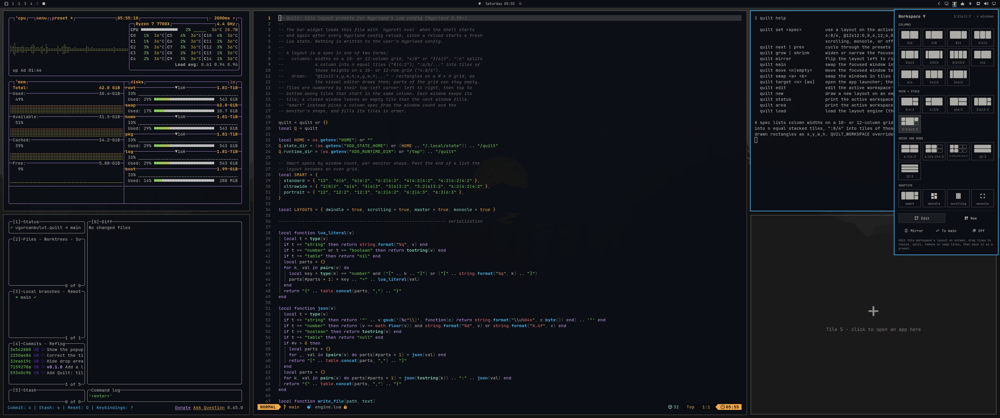
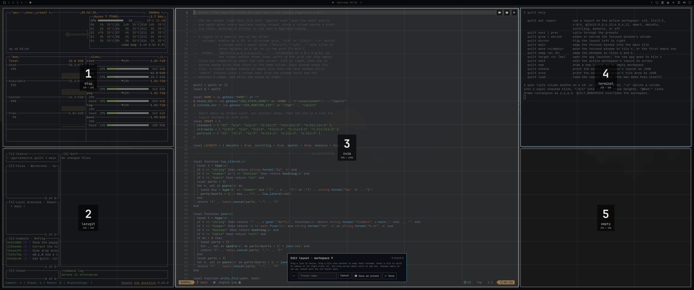

# Quilt

An [Omarchy](https://omarchy.org) bar widget for tiling layouts. Pick a layout from the popup and the windows on your current workspace arrange into it. They stay tiled, new windows flow into the layout, and empty tiles turn into drop areas you can click to open an app right there. To make your own layouts, draw them on screen.



## Layouts on a grid

Every layout is written as column widths on a **10- or 12-column grid**, separated by `|`. The total tells Quilt which grid you mean:

| Spec | Grid | Result |
|---|---|---|
| `6|6` | 12 | Two halves |
| `4|8` | 12 | One third, two thirds |
| `4|4|4` | 12 | Three equal columns |
| `3|6|3` | 12 | A wide center column, great on ultrawide monitors |
| `4|6` | 10 | 40% and 60% |
| `2|6|2` | 10 | 20% · 60% · 20% |

Add `:n` to split a column into `n` stacked tiles of the same height, or list the heights (adding up to 10 or 12) to make them uneven:

| Spec | Result |
|---|---|
| `8|4:2` | A main window with two stacked on the right |
| `3|6|3:2` | A centered main window, two stacked on the right |
| `6:2|6:2` | A 2 × 2 grid |
| `12:3` | Three rows, for vertical monitors |
| `4:8/4|8` | On the left, a tall tile over a short one; a wide column on the right |

Anything that isn't columns can be drawn as rectangles on a grid: `@12x12:` followed by `x,y,width,height` for each tile, in grid cells. `@12x12:0,0,12,4;0,4,6,8;6,4,6,8` is a banner across the top with two tiles under it. Cells no tile covers stay empty, and tiles can't overlap. You rarely need to type these: the editor writes them for you.

Tiles are numbered by their top-left corner: left to right, and top to bottom among tiles that start in the same column. In `6:2|6:2`, tiles 1 and 2 are the left column.

The popup has two tabs of layouts, and a gear tab for settings. **Built-in** holds 28 layouts in four groups (columns, main + stack, grids and rows, adaptive), each shown as a small picture of your current number of windows; **Yours** holds the ones you make. The popup opens on the tab with the current layout. Hover a layout to read what it does.

## Features

- **Windows keep their tiles.** Close a window and its tile stays empty instead of the others shifting around. The next window you open fills it.
- **Extra windows become tabs.** With more windows than tiles, the extras join the last tile as tabs (Hyprland's window groups) and move back out into their own tiles as soon as there's room, oldest first. A group you make yourself with Super+G takes one tile and keeps it while you switch tabs.
- **Drop areas.** Empty tiles show an outline with a "+". Click one to open the app launcher; the app you pick opens in that tile.
- **Arrow keys reach empty tiles.** On a grid layout, Omarchy's Super+arrows move tile to tile, empty ones included. An empty tile you stop on lights up and takes the keyboard: Enter opens the app launcher for it, Escape goes back to your window. Any app you open meanwhile, from the launcher or a key binding, goes there. The window you left shows an inactive border until you move on, and a tile with a window focuses that window, as before.
- **Main first.** Windows fill the biggest tile first, so a single window in `3|6|3` sits in the middle.
- **App homes and one-click launch.** A layout can remember which app goes in which tile, so your browser always opens in the middle and terminals on the right, and one click opens the apps that aren't there yet. See [App homes](#app-homes).
- **Monitor defaults.** New workspaces on a monitor can start with a layout of your choice, like Smart on an ultrawide.
- **Swap with the keyboard or mouse.** Omarchy's Super+Shift+arrows swaps the focused window with the one in the next tile, or moves it there if that tile is empty, and Super+drag drops a window onto another tile, trading places with the window there (or moving into an empty tile).
- **Smart layout.** Picks the layout from the number of windows and the monitor's shape:

  | Windows | Standard | Ultrawide | Vertical |
  |---|---|---|---|
  | 1 | `12` | `2|8|2` | `12` |
  | 2 | `6|6` | `6|6` | `12:2` |
  | 3 | `6|6:2` | `3|6|3` | `12:3` |
  | 4 | `6:2|6:2` | `3|6|3:2` | `6:2|6:2` |

  Past six windows it switches to an even grid. You can set your own layouts for any window count (see [Your own Smart](#your-own-smart-and-monitor-defaults)).

- **Live control.** Scroll on the bar icon to widen or narrow the focused window's column by one grid column (a centered column grows on both sides). Right-click the icon for the next layout. In the popup, **Mirror** flips the layout and **To main** swaps the focused window into the biggest tile.
- **Per workspace, remembered.** Each workspace keeps its own layout across Hyprland reloads and reboots. The bar icon draws the current workspace's layout.
- **Hyprland's own layouts too.** Dwindle (Omarchy's default), scrolling and monocle are one click away, and **Off** hands the workspace back to Omarchy: its default layout, or the one you picked for that workspace with Super+L.
- **Nothing written to your Hyprland config.** Quilt registers its layout while Hyprland runs and registers it again after every config reload. Removing the plugin leaves no trace in your config.

## The editor

The popup has two buttons for making layouts of your own:

- **Edit** opens the current workspace's layout on screen, over your windows. Drag the lines between tiles to resize them, hover a tile to split it or remove it, drag a tile onto another to swap their windows, and drag across empty cells to add a tile. Every change applies as you make it. **Save as preset** keeps it in your presets, **Done** keeps it on this workspace only, and **Cancel** (or Esc) puts the old layout back. Windows you swapped stay where you put them.
- **New** takes you to an empty workspace (99, or the next free one below it) and shows a blank 12 × 12 grid; switch to 10 × 10 if you like. Drag across the grid to draw tiles of any shape and size, and leave cells empty wherever you want a gap. **Save** adds it to your presets, **Save and use** also puts it on the workspace you came from, and either one takes you back there.

Ctrl+Z undoes the last change. The toolbar can be dragged by its title if it covers a tile.



## App homes

Give a tile an app and that app opens there, whatever else is on the workspace:

- In the editor, turn on **Remember apps** before **Save as preset** or **Done**. Each tile keeps the app that's in it now.
- Or run `quilt home` on the focused window to make its tile that app's home (`quilt home 3` for tile 3; `quilt home 3 none` clears it).

A new window goes to its app's home if it's free. If something else sits there, that window steps aside to a free tile (or shares the overflow tile when none is free). Other windows fill the free tiles first and use an empty home only when nothing else is left, so the tile is still free when its app opens. Switching to a preset with homes also moves the windows already on the workspace into them. Apps are matched by their window class, which the editor shows on each tile.

### Launching

- In the popup, presets with app homes have a rocket in the corner. Click it (or press `O` on the preset) to use the preset and open each of its apps that isn't on the workspace yet, straight into its tile.
- An empty home tile's drop area opens its own app when clicked. Right-click it to pick another app from the launcher.
- `quilt launch` does the same for the current workspace, and `quilt launch 3` opens tile 3's app.

Quilt starts apps the way Omarchy's launcher does, finding each one's desktop entry by its window class, including web apps installed with Omarchy. If you switch workspaces while an app is starting, its window still arrives on the workspace it was opened for.

## Install

```bash
omarchy plugin add https://github.com/ugurcanbulut/omarchy-quilt.git --enable
```

The widget is added to the right section of the bar. To move it:

```bash
omarchy bar move ugurcanbulut.quilt --section right --index 0
```

## Custom layouts

Layouts saved from the editor show up on the popup's **Yours** tab and in the next/previous cycle. Right-click one twice to remove it.

They live in a `presets` list on the Quilt entry in your bar layout in `~/.config/omarchy/shell.json`, where you can also add them by hand:

```json
{ "id": "ugurcanbulut.quilt",
  "presets": [
    "5|7",
    { "spec": "2|8|2", "label": "Focus", "gapsOut": 40 },
    { "spec": "3|6|3", "label": "Dev", "apps": { "1": "obsidian", "2": "chromium", "3": "alacritty" } }
  ] }
```

- A preset is a spec string, or an object with `spec` and optional `label`, `gapsIn` and `gapsOut` (in pixels), and `apps` (tile number to window class, see [App homes](#app-homes)).
- `quilt use Dev` applies a preset by its label, which is handy for key bindings.
- Add `"builtInPresets": false` to keep only the adaptive layouts (Smart, Dwindle, Scrolling, Monocle) on the Built-in tab.
- Add `"overflow": "stack"` to stack extra windows in the last tile instead of making them tabs.
- Add `"navigation": false` to give Super+arrows and Super+Shift+arrows back to Hyprland's plain focus move and swap.

## Settings

The gear tab in the popup holds Quilt's settings:

- **Show built-in layouts**, **Drop areas on empty tiles**, **Arrow keys reach empty tiles** and **Scroll on the bar icon to resize**, each on or off.
- **Extra windows**: as tabs in the last tile, or stacked there.
- **New workspaces start with**: a default layout for each connected monitor (see [monitor defaults](#your-own-smart-and-monitor-defaults)).
- **Smart on … monitors**: the layout Smart uses for 1 to 6 windows on monitors shaped like the one you're on.

Choosing a layout opens a picker of the same pictures as the other tabs. Everything is saved to the Quilt entry in `~/.config/omarchy/shell.json`, which you can also edit by hand.

### Your own Smart and monitor defaults

Two more settings on the same entry:

```json
{ "id": "ugurcanbulut.quilt",
  "smart": { "ultrawide": ["3|6|3", "6|6", "3|6|3"] },
  "monitors": { "DP-3": "smart", "eDP-1": "Dev" } }
```

- `smart` sets Smart's layout for 1, 2, 3, ... windows, per monitor shape: `standard`, `ultrawide` (2:1 and wider) or `portrait`. Where your list has no usable layout for a window count (it's shorter, or the entry is `null`), Smart uses its own.
- `monitors` gives new workspaces on a monitor a layout: a spec, `smart`, a Hyprland layout, or one of your presets by label (with its gaps and apps). Run `hyprctl monitors` for the names. A workspace keeps following its monitor's default, including when you change it, until you pick a layout or Off there yourself.

## Keys

In the popup, the arrow keys and Enter pick a layout, and these act right away:

| Key | Action |
|---|---|
| `e` | Edit the current layout |
| `o` | Use the preset under the cursor and open its apps |
| `n` | Draw a new layout |
| `m` | Mirror |
| `s` | Focused window to the main tile |
| `x` | Off |

On a grid layout, Super+arrows move between tiles and Super+Shift+arrows move windows between them, empty tiles included (see [Features](#features)). Quilt takes each set over only while it is Omarchy's own and hands it back when you turn the setting off; if you've bound them to something else, Quilt leaves them alone. Otherwise Quilt doesn't add key bindings of its own. To add some, put lines like these in `~/.config/hypr/bindings.lua`:

```lua
local quilt = os.getenv("HOME") .. "/.config/omarchy/plugins/ugurcanbulut.quilt/quilt"
o.bind("SUPER + CTRL + ALT + RIGHT", "Next layout", quilt .. " next")
o.bind("SUPER + CTRL + ALT + LEFT", "Previous layout", quilt .. " prev")
o.bind("SUPER + CTRL + ALT + EQUAL", "Widen column", quilt .. " grow")
o.bind("SUPER + CTRL + ALT + MINUS", "Narrow column", quilt .. " shrink")
o.bind("SUPER + CTRL + ALT + RETURN", "Window to main tile", quilt .. " main")
o.bind("SUPER + CTRL + ALT + E", "Edit layout", quilt .. " edit")
o.bind("SUPER + CTRL + ALT + H", "Make this tile the app's home", quilt .. " home")
o.bind("SUPER + CTRL + ALT + 1", "Window to tile 1", quilt .. " move 1")
```

Check `omarchy menu keybindings --print` first for chords you already use.

## Command line

```bash
quilt set <spec>        # 4|8, 3|6|3:2, 4:8/4|8, @12x12:..., smart, dwindle, scrolling, monocle, off
quilt use <name>        # one of your presets, by label or spec, with its gaps and apps
quilt next | prev       # cycle through the layouts
quilt grow | shrink     # widen or narrow the focused window's column
quilt mirror            # flip the layout left to right
quilt main              # swap the focused window into the main tile
quilt move <n|empty>    # move the focused window to tile n, or the first empty tile
quilt swap <a> <b>      # swap the windows in tiles a and b
quilt target <n>        # open the app launcher; the new app goes to tile n
quilt deselect          # drop the empty tile picked with Super+arrows
quilt launch [n]        # open the home apps missing from the workspace, or tile n's app
quilt home [n] [app]    # make tile n home to an app (default: the focused window's); "none" clears it
quilt homes [json]      # print or replace the workspace's app homes, like {"2":"chromium"}
quilt edit | new        # open the editor
quilt status            # the active workspace's layout, as JSON
quilt area              # the area its tiles share, as JSON
```

Set `QUILT_WORKSPACE` to act on a workspace other than the active one, as in `QUILT_WORKSPACE=3 quilt set 4|8`.

## Requirements

- Omarchy 4 with Hyprland 0.55 or newer (Hyprland's Lua config)
- `jq`, part of a standard Omarchy install

## How it works, and its limits

- Quilt is a Hyprland layout written in Lua (`engine.lua`), loaded into the running Hyprland by the bar widget. Hyprland reloads its config whenever you save a Hyprland config file, which starts a fresh Lua state; the widget notices and loads Quilt again within a moment, and windows return to their tiles.
- Dragging the border between two tiled windows doesn't resize a Quilt layout. Use the editor, or scroll on the bar icon (`quilt grow` / `quilt shrink`) for column layouts.
- Omarchy's Super+L toggles between dwindle and scrolling on its own. On a Quilt workspace, pick Dwindle or Off in Quilt instead, or Quilt brings its layout back after the next config reload.
- Hyprland's Lua layout API is new and Hyprland describes it as not yet stable, so a future Hyprland release may need a Quilt update.
- The state lives in `~/.local/state/quilt/`. Deleting that folder forgets every workspace's layout.

## License

MIT
